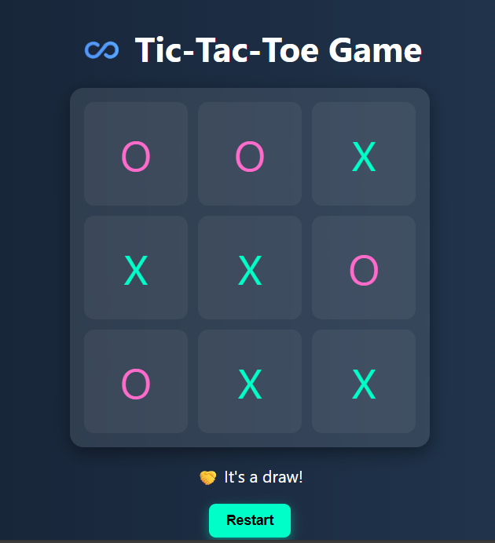
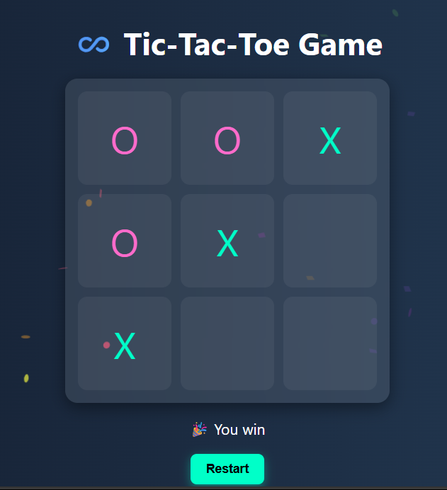

# ♾️ Tic-Tac-Toe Game

A stylish and interactive **Tic-Tac-Toe game** built using **HTML**, **CSS**, and **JavaScript**. Play against a smart AI with animations and confetti celebration on winning 🎉.

---

## 🚀 Features

- 🎮 Player vs AI
- 🧠 Smart AI using Minimax with some randomness
- 🎉 Confetti win celebration
- 💡 Stylish and modern glassmorphism UI
- 🔁 Restart button to reset the game

---

## 📸 Preview

- ### Draw

- ### When AI Win

- ### You Win 

---

## 🛠️ Tech Stack

- HTML
- CSS
- JavaScript
- [Canvas Confetti](https://www.npmjs.com/package/canvas-confetti)

---

## 📂 Folder Structure

